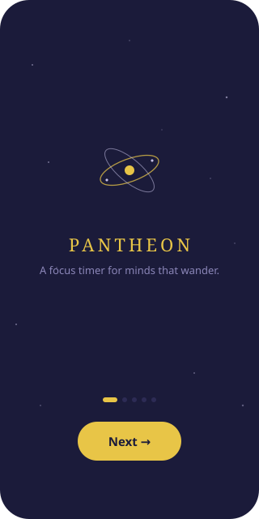
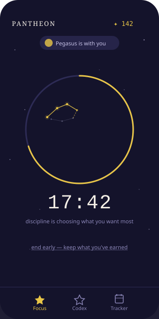
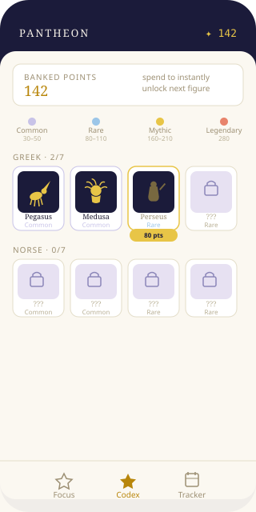

# Pantheon 🌌

**A gamified focus timer for minds that wander.**

Pantheon is a free iOS app designed for people with ADHD and anyone who struggles to stay focused. Press start, pick a duration, and a figure from world mythology slowly reveals itself — drawn star by star — for as long as you stay focused. Every session builds your personal sky across five real mythologies.

No punishment for leaving early. No streak-shaming. No accounts. Just focus, and the sky you're building.

---

## Screenshots

| Welcome | Focus Session | Codex |
|---|---|---|
|  |  |  |

---

## What it does

### Core loop
- Pick a focus duration (5 / 15 / 25 / 45 minutes)
- Choose a pantheon — Greek, Norse, Egyptian, Japanese, or Chinese
- A legendary figure reveals itself as a constellation, drawn star by star, as you focus
- Leave early and keep partial credit — no shame, no penalty
- Complete the session for a +20% points bonus

### Progression
- **35 figures** across 5 mythologies, from Common to Legendary tier
- Each pantheon unlocks sequentially — Pegasus before Perseus, Kitsune before Amaterasu
- **Two paths to unlock:** focus passively during sessions, or spend banked points directly in the Codex for an instant unlock
- Overflow points roll forward automatically — nothing wasted

### Codex
- Full grid of all 35 figures, grouped by mythology
- Tap any unlocked figure for its full mythological lore
- Set any unlocked figure as a **Companion** — they appear alongside you during sessions
- Tier legend showing point costs at a glance

### Session screen
- Progress ring showing this session's completion %
- Milestone pulse at 25%, 50%, and 75%
- Occasional shooting stars
- Sky deepens as the session progresses
- Rotating motivational phrases every 5 minutes

### Calendar tracker
- Month-by-month view of every session you've started
- Today always clearly marked

### Onboarding
- 6-page intro explaining the mechanic, the partial-credit system, and the tone
- Replayable anytime from the Codex

---

## Design principles

These aren't nice-to-haves — they're what makes Pantheon appropriate for its audience:

- **No punishment for leaving early.** Partial credit, always.
- **No streak-shaming.** Missing a day changes nothing.
- **No accounts.** Progress lives on your device.
- **Free.** No ads, no paywall on the core experience.
- **5 minutes is real progress.** Tiny sessions are treated with the same respect as long ones.

---

## Mythology roster

| Greek | Norse | Egyptian | Japanese | Chinese |
|---|---|---|---|---|
| Pegasus | Sleipnir | Bastet | Kitsune | Qilin |
| Medusa | Tyr | Sobek | Momotaro | Houyi |
| Perseus | Valkyrie | Thoth | Tsukuyomi | Chang'e |
| Andromeda | Loki | Horus | Raijin | Nuwa |
| Orion | Thor | Isis | Susanoo | Zhulong |
| Hercules | Fenrir | Anubis | Yamata-no-Orochi | Pangu |
| Atlas | Odin | Ra | Amaterasu | Sun Wukong |

---

## Repository contents

```
pantheon-repo/
├── README.md                  — This file
├── pantheon-prototype.jsx     — Fully interactive React prototype (open in Claude.ai)
├── build-plan.md              — Full SwiftUI build plan, data model, and App Store checklist
└── screenshots/
    ├── 01-onboarding.html     — Welcome screen mockup
    ├── 02-focus-session.html  — Active session screen mockup
    └── 03-codex.html          — Codex screen mockup
```

---

## Status

- [x] Interactive prototype (React/JSX) — complete
- [x] Feature spec & SwiftUI build plan — complete
- [ ] Native iOS app (SwiftUI) — in progress
- [ ] App Store submission

---

## Tech stack (prototype)

- React (JSX)
- Tailwind CSS
- SVG-based constellation drawing
- Timestamp-based background-safe timer
- `window.storage` persistence

## Tech stack (native iOS — planned)

- SwiftUI
- `UserDefaults` + `NSUbiquitousKeyValueStore` (iCloud sync)
- `Date`-based background-safe timer (same logic as prototype, ported to Swift)
- `UNUserNotificationCenter` (optional daily nudge)

---

## Running the prototype

The prototype is a single `.jsx` file designed to run inside [Claude.ai](https://claude.ai) as a React artifact. Open `pantheon-prototype.jsx` and paste it into a Claude chat requesting a React artifact, or open it as an artifact directly if you have the link.

---

## License

Personal project — not yet licensed for distribution. App Store release pending.
